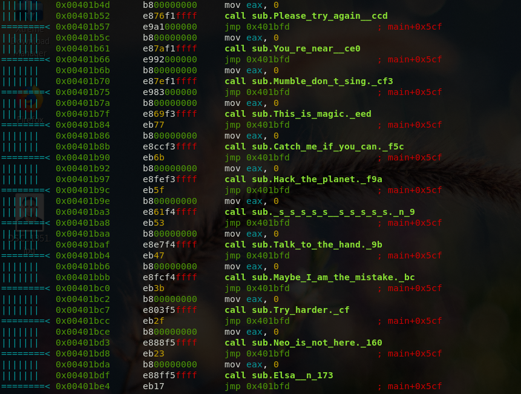
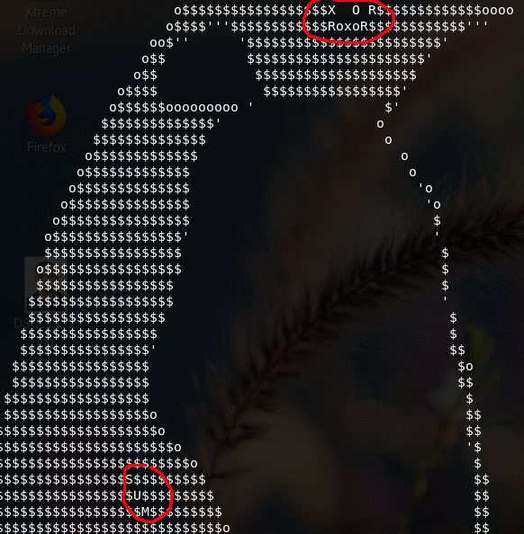

## Description:
A file was obtained from an E-Society File Server. Find the hidden file!!!!

## File:
[Where_is_my_file](Where_is_my_file)

## Solution:

Using the ```trid``` command to examine the file type

```zsh
peter at kali in [~/KPMG-Cyber-Security-Challenge-2017/ACT 3/Where Is The File]  on git:master ✗  bb9ee5b "Add README.md file and deleted readme.txt file"
16:47:35 › trid Where_is_my_file 

TrID/32 - File Identifier v2.24 - (C) 2003-16 By M.Pontello
Definitions found:  7328
Analyzing...

Collecting data from file: Where_is_my_file
       Unknown!
```

The trid command says the file is an unknown type so, we use ```xxd``` to open the file

```zsh
peter at kali in [~/KPMG-Cyber-Security-Challenge-2017/ACT 3/Where Is The File]  on git:master ✗  bb9ee5b "Add README.md file and deleted readme.txt file"
16:52:16 › xxd Where_is_my_file | less

00000000: efd5 dcd6 9291 9193 9090 9090 9090 9090  ................
00000010: 9290 ae90 9190 9090 a099 d090 9090 9090  ................
00000020: d090 9090 9090 9090 081d 9e90 9090 9090  ................
00000030: 9090 9090 d090 a890 9690 d090 8d90 8c90  ................
00000040: 9190 9090 9590 9090 9090 9090 9090 9090  ................
00000050: 9090 d090 9090 9090 9090 d090 9090 9090  ................
00000060: dbf6 9e90 9090 9090 dbf6 9e90 9090 9090  ................
00000070: 9090 b090 9090 9090 9190 9090 9690 9090  ................
00000080: 50fe 9e90 9090 9090 50fe fe90 9090 9090  P.......P.......
00000090: 50fe fe90 9090 9090 e08d 9090 9090 9090  P...............
000000a0: b8a6 9090 9090 9090 9090 b090 9090 9090  ................
000000b0: 9490 9090 9490 9090 0091 9090 9090 9090  ................
000000c0: 0091 d090 9090 9090 0091 d090 9090 9090  ................
000000d0: d490 9090 9090 9090 d490 9090 9090 9090  ................
000000e0: 9490 9090 9090 9090 9790 9090 9490 9090  ................
000000f0: 50fe 9e90 9090 9090 50fe fe90 9090 9090  P.......P.......
00000100: 50fe fe90 9090 9090 b090 9090 9090 9090  P...............

```
As we can see the file contains a lot of ```0x90``` bytes. So, from here we can guess that, the file is XOR-ed using ```0x90``` key. Then, here the python script to decode the file:

```python
#!/usr/bin/env python

import sys

inputfile = open('Where_is_my_file','rb')
outputfile = open('decoded_file','w+b')
byte = inputfile.read(1)

while byte != "":
    byte = ord(byte)
    byte = byte ^ 0x90
    outputfile.write('%c' % byte)
    byte = inputfile.read(1)

outputfile.close()
```
Inspect the ```decoded_file``` using ```file``` command.

```zsh
peter at kali in [~/KPMG-Cyber-Security-Challenge-2017/ACT 3/Where Is The File]  on git:master ✗  01b8593 "Add the decoded_file"
17:16:38 › file decoded_file
decoded_file: ELF 64-bit LSB executable, x86-64, version 1 (GNU/Linux), statically linked, for GNU/Linux 2.6.32, BuildID[sha1]=1963f496f342a9106e67884a2a686ca7a350acf7, stripped
```

The ```file``` command states that the file is an ```ELF``` file. We reverse engineer the ```ELF``` file to see how program works but in this write up we used Radare2 to reverse engineer the program. Run ```radare2 ./decoded_file``` and then use ```aaa``` command to analyse all the strings and function call references.

```zsh
peter at kali in [~/KPMG-Cyber-Security-Challenge-2017/ACT 3/Where Is The File]  on git:master ✗  f5fc59f "update README.md"
18:11:46 › radare2 ./decoded_file
Warning: Cannot initialize dynamic strings
 -- Change the registers of the child process in this way: 'dr eax=0x333'
[0x00400930]> aaa
[x] Analyze all flags starting with sym. and entry0 (aa)
[x] Analyze len bytes of instructions for references (aar)
[x] Analyze function calls (aac)
[x] Use -AA or aaaa to perform additional experimental analysis.
[x] Constructing a function name for fcn.* and sym.func.* functions (aan)
```

Use ```pdf @main``` command to disassemble the main function and we can see some sort of random case for the switch statement has been used in the program. 



Every time the program executes it will generate a random number and select  a random case from the switch statement and produce an output and a file. Then we loop over all the switch statements and the program generates a lot of files and outputs. Most of the files generated is an image file but only two of them seem suspicious because the files are not an image file.


Besides, the ```Everyone dance with me.jpg``` gives us a hint, that the image is splitted into three parts. The first part is ```Everyone dance with me.jpg```, the second part is ```Feel your feet.jpg``` and the third part is ```Sliding through the ice.jpg``` but the second part is encrypted and we need the key. The hints for the key is quite tricky because we need to look at every output generated from the program, from there we can guess the key. First we look at the ascii penguin ouput:



As we can see the ```XOR``` and ```SUM`` hints inside the ascii penguin. Then, ```Little indian song``` also gives us the hint on how to find the key.


